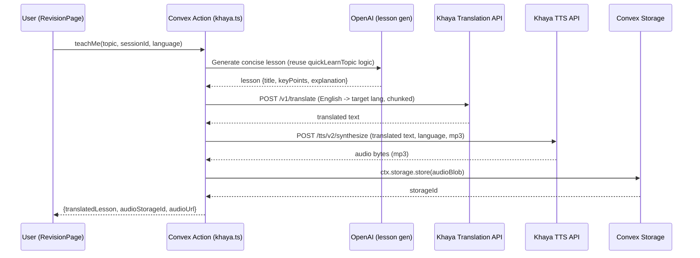

# Khaya AI Translation + TTS Integration

## Architecture Overview

## API Endpoints Confirmed

- **Translation**: `POST https://translation-api.ghananlp.org/v1/translate`
  - Body: `{ "in": "text", "lang": "en-tw" }`
  - Max 1000 chars per request (needs chunking)
  - Supported target langs: tw, ee, gaa, fat, yo, dag, ki, gur, luo, mer, kus
- **TTS Synthesize**: `POST https://translation-api.ghananlp.org/tts/v2/synthesize`
  - Body: `{ "text": "...", "language": "twi", "speaker_id": "female", "stream": false, "format": "mp3" }`
  - Returns audio bytes
  - 32+ languages supported
- **Auth header**: `Ocp-Apim-Subscription-Key` (Azure APIM standard) -- will use `process.env.KHAYA_KEY`

## Language Code Mapping

Translation API and TTS API use different codes for the same languages. A mapping is needed:

| Language | Translation Code | TTS Code |
| -------- | ---------------- | -------- |
| Twi      | tw               | twi      |
| Ewe      | ee               | ewe      |
| Yoruba   | yo               | yor      |
| Kikuyu   | ki               | kik      |
| Ga       | gaa              | gaa      |
| Fante    | fat              | fat      |
| Dagbani  | dag              | dag      |
| Gurene   | gur              | gur      |
| Luo      | luo              | luo      |
| Kimeru   | mer              | mer      |
| Kusaal   | kus              | kus      |

Languages with TTS but NO translation support (20+ langs like Hausa, Igbo, Swahili, etc.) will get TTS of the English content only.

---

## File Changes

### 1. New file: `convex/khaya.ts`

A Convex action file (default V8 runtime, NO `"use node"`) using `fetch()` for Khaya API calls, and `ctx.runAction` to call the existing `quickLearnTopic` from [convex/ai.ts](convex/ai.ts) (Node runtime -- cross-runtime call is valid per guidelines).

**Exports:**

- `teachMe` (public action) -- main entry point from frontend
  - Args: `topic: v.string()`, `sourceSessionId: v.id("studySessions")`, `targetLanguage: v.string()`, `speakerId: v.optional(v.string())`
  - Flow:
    1. Auth check via `authComponent.getAuthUser(ctx)`
    2. Call `ctx.runAction(api.ai.quickLearnTopic, { topic, sourceSessionId })` to generate English lesson
    3. Build full lesson text from `lesson.title + keyPoints + explanation`
    4. If target language has translation support, call Khaya Translation API (chunk text at 1000-char boundaries respecting sentence breaks)
    5. Call Khaya TTS API with translated (or English) text, get audio bytes
    6. Store audio blob via `ctx.storage.store(blob)`, get `storageId`
    7. Get audio URL via `ctx.storage.getUrl(storageId)`
    8. Return `{ originalLesson, translatedText, audioUrl, languageName }`

**Internal helpers** (plain functions, not exported Convex functions):

- `translateText(text, fromLang, toLang, apiKey)` -- handles chunking for 1000-char limit, calls `POST /v1/translate`
- `synthesizeSpeech(text, languageCode, speakerId, format, apiKey)` -- calls `POST /tts/v2/synthesize`, returns audio `Blob`
- `TRANSLATION_TO_TTS_MAP` -- constant mapping translation codes to TTS codes
- `TTS_LANGUAGES` -- full list of `{ name, ttsCode, translationCode? }` objects

### 2. Modify: [src/pages/RevisionPage.tsx](src/pages/RevisionPage.tsx)

This is the main file for UI changes (~680 lines currently). Changes:

**A. Language Selector (page header area, line ~501-508)**

- Add a dropdown/select after the page description
- Populate with all 32+ TTS-supported languages from a constant (defined in a shared file or inline)
- Persist selected language in `localStorage` under key `"studyg-teach-language"`
- Default to the first language or "Asante Twi"

**B. "Teach Me" Button (expanded item panel, line ~636-645)**

- Add a new button below "Quick Learn & Revise" with gradient styling (green/teal to differentiate)
- Label: "Teach Me" with a `Languages` or `Volume2` icon from lucide-react
- Show selected language name in the button text: "Teach Me in Twi"
- onClick triggers `startTeachMe(item._id, item.topic, item.sourceSessionId)`

**C. "Teach Me" Overlay (new section, similar to Quick Learn overlay at lines 172-494)**

- Full-screen overlay with:
  - Loading state: "Translating to [Language]..." with spinner
  - Translated content display:
    - Original lesson title
    - Translated key points
    - Translated explanation text
    - If language doesn't support translation, show English with a note
  - Audio player:
    - Play/Pause button (large, centered)
    - Use HTML `<audio>` element with the returned audio URL
    - Speaker selection dropdown (male_low, male_high, female)
  - "Done" button to exit overlay

**D. New state variables:**

- `teachMeItemId` -- active teach-me item ID
- `teachMeData` -- returned translated lesson + audio URL
- `teachMeLoading` -- loading state
- `selectedLanguage` -- from localStorage, the chosen TTS language

### 3. Environment variable

- Set `KHAYA_KEY` in Convex environment via `npx convex env set KHAYA_KEY <value>`
- This is a server-side env var accessed by `process.env.KHAYA_KEY` in Convex actions

---

## Key Design Decisions

- **No schema changes needed**: Language preference is stored client-side in localStorage. Audio is ephemeral (generated on demand, stored in Convex file storage temporarily). No new tables required.
- **Default runtime for khaya.ts**: Since we only need `fetch()` and `ctx.storage`, the default V8 runtime is sufficient. Cross-runtime `ctx.runAction` to `ai.quickLearnTopic` (Node) is explicitly allowed by Convex guidelines.
- **Audio format**: MP3 for small file size and universal browser support.
- **Translation chunking**: Split text at sentence boundaries (`.`  or `\n`) to stay under 1000-char limit per API call, then rejoin translated chunks.
- **Graceful degradation**: For the 20+ TTS-only languages (no translation support), the feature still works by reading the English content aloud in the selected language's voice/accent.

