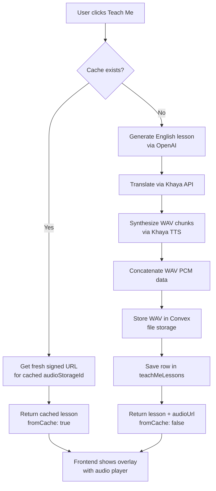

# Khaya Audio Fix & Lesson Caching

## Root Cause: Audio Not Playing

The `synthesizeSpeechChunk` function requests `format: "mp3"` but the Khaya TTS API returns WAV audio. The buffer is stored as `audio/mpeg`, so the browser fails to decode it. WAV files also cannot be simply byte-concatenated (each has its own RIFF header + PCM data), unlike MP3 frames.

**Fix:**

- Change `format: "mp3"` → `format: "wav"` in `synthesizeSpeechChunk`
- Change MIME type `audio/mpeg` → `audio/wav` in `teachMe`
- Replace the naive MP3 byte-concat in `synthesizeSpeech` with a `concatenateWav` helper that:
  1. Reads the RIFF/fmt header from the first chunk to extract `numChannels`, `sampleRate`, `bitsPerSample`
  2. Locates and extracts raw PCM data from every chunk (scanning for the `"data"` sub-chunk marker)
  3. Writes a single new 44-byte WAV header (with total PCM size) and appends all PCM segments

## Caching Plan

### 1. Schema — `convex/schema.ts`

Add a new `teachMeLessons` table:

```ts
teachMeLessons: defineTable({
  userId: v.string(),
  revisionItemId: v.id("revisionItems"),
  targetLanguage: v.string(),
  speakerId: v.string(),
  originalLesson: v.object({ title: v.string(), keyPoints: v.array(v.string()), explanation: v.string() }),
  translatedLesson: v.object({ title: v.string(), keyPoints: v.array(v.string()), explanation: v.string() }),
  isTranslated: v.boolean(),
  languageName: v.string(),
  audioStorageId: v.id("_storage"),
  createdAt: v.number(),
})
  .index("by_user_item_lang_speaker", ["userId", "revisionItemId", "targetLanguage", "speakerId"])
```

### 2. Backend — `convex/khaya.ts`

**New internal query** `findCachedLesson`:

- Looks up `teachMeLessons` by `(userId, revisionItemId, targetLanguage, speakerId)` using the new index

**New internal mutation** `saveCachedLesson`:

- Inserts a row into `teachMeLessons` (or replaces existing via `ctx.db.delete` + `ctx.db.insert`)

**Modify `teachMe` action**:

- Accept optional `forceRegenerate: v.optional(v.boolean())` arg
- If `!forceRegenerate`, call `ctx.runQuery(internal.khaya.findCachedLesson, ...)` first
- If a cached row is found: get a fresh signed URL via `ctx.storage.getUrl(cachedLesson.audioStorageId)` and return immediately with `fromCache: true`
- If not cached (or forced): run full generate → translate → synthesize flow, then call `ctx.runMutation(internal.khaya.saveCachedLesson, ...)` before returning

**New public query** `getCachedLesson`:

- Args: `revisionItemId`, `targetLanguage`, `speakerId`
- Returns `{ exists: boolean }` — lets the frontend show a "Cached" badge on the button

### 3. Frontend — `src/pages/RevisionPage.tsx`

- Add `fromCache?: boolean` to the `TeachMeData` type
- Call `useQuery(api.khaya.getCachedLesson, { revisionItemId: item._id, targetLanguage, speakerId })` for each expanded card to show a small "Saved" badge on the "Teach Me" button
- In the Teach Me overlay header, show a small "Cached" chip when `teachMeData.fromCache` is true
- Add a "Regenerate" button (with a `RefreshCw` icon) in the overlay that calls `teachMeAction(..., { forceRegenerate: true })` and clears the displayed data

## Flow Diagram




## Key Files

- `[convex/schema.ts](convex/schema.ts)` — add `teachMeLessons` table
- `[convex/khaya.ts](convex/khaya.ts)` — WAV fix + caching logic (internal query/mutation + modified action + new public query)
- `[src/pages/RevisionPage.tsx](src/pages/RevisionPage.tsx)` — cache badge, `fromCache` indicator, Regenerate button

