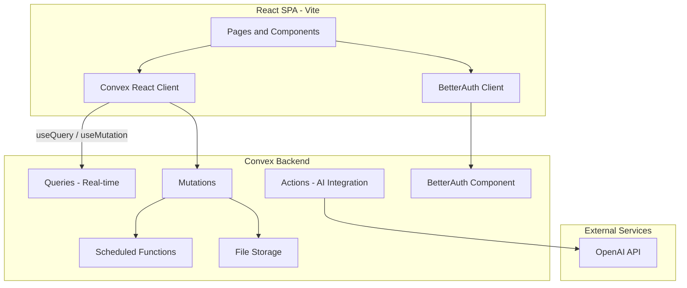
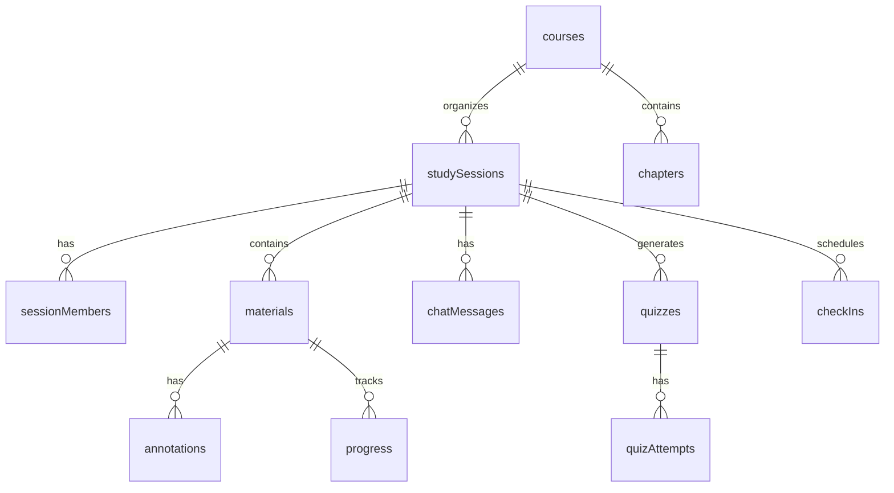

# StudyG - Virtual Group Learning Companion

## Tech Stack

- **Frontend**: React 19 + Vite + TypeScript
- **Styling**: Tailwind CSS v4 + Shadcn/ui
- **Routing**: React Router v7
- **Backend**: Convex (real-time database, file storage, scheduled functions, actions)
- **Auth**: BetterAuth via `@convex-dev/better-auth`
- **AI**: OpenAI API (via Convex actions) for quiz generation and material processing

## Architecture Overview



## Convex Database Schema

Key tables (defined in `convex/schema.ts`):

- **courses** - subjects/courses created by users
- **chapters** - chapters within courses
- **studySessions** - core entity: learning period, scope, settings, invite code
- **sessionMembers** - users in a session with role, status, personal learning speed
- **materials** - uploaded docs/images linked to sessions (references `_storage`)
- **progress** - per-user, per-material page tracking with timestamps
- **checkIns** - periodic check-in prompts and responses during sessions
- **quizzes** - AI-generated quizzes with questions, options, explanations
- **quizAttempts** - user answers and scores per quiz
- **chatMessages** - real-time group chat within sessions
- **annotations** - shared notes on specific pages of materials
- **revisionItems** - topics flagged for review using spaced repetition scheduling
- **learningStats** - aggregated per-user statistics (streak, hours, avg score)



## Key Feature Implementation Details

### 1. Authentication (BetterAuth + Convex)

- Install `@convex-dev/better-auth` and `better-auth`
- Register the BetterAuth component in `convex/convex.config.ts`
- Configure auth in `convex/auth.config.ts` with email/password + social providers
- Create `src/lib/auth-client.ts` for the frontend BetterAuth client
- Wrap app with `ConvexProvider` + auth context

### 2. Study Session Creation

- Form to set: title, course, chapters/topics, start/end time, learning speed (min/page)
- Upload multiple documents/images using Convex file storage (`generateUploadUrl` pattern)
- Option to make session public or generate a private invite code for group study
- On creation, schedule periodic check-in functions via `ctx.scheduler.runAt()`

### 3. Learning Speed and Progress Tracking

- Default speed set at session creation (e.g., 3 min/page), adjustable per member
- Material viewer shows current page with navigation
- Progress auto-saves on page change via mutation
- Estimated completion time calculated from speed x remaining pages
- Real-time progress bar visible to all session members via Convex subscriptions

### 4. Periodic Check-Ins (Convex Scheduled Functions)

- When session starts, schedule check-in mutations at intervals (e.g., every 20 min)
- Each check-in triggers a UI notification asking "How's your progress?"
- User responds: on-track / struggling / ahead, with optional notes
- Responses stored and used to adjust revision priority

### 5. AI-Generated Quizzes (Convex Actions + OpenAI)

- After a session completes (or on-demand), trigger a Convex action
- Action extracts text from uploaded materials (OCR for images via OpenAI Vision, text extraction for docs)
- Sends content to OpenAI with prompt to generate quiz questions (MCQ + short answer)
- Questions tagged by topic and difficulty level
- Results stored in `quizzes` table, user attempts in `quizAttempts`
- Score analysis identifies weak areas -> feeds into revision system

### 6. Revision System (Spaced Repetition)

- After each quiz, topics where user scored poorly are flagged as `revisionItems`
- Uses a simplified SM-2 algorithm to schedule next revision date
- Dashboard shows upcoming revisions sorted by urgency
- Revision sessions re-surface materials and re-quiz on weak topics
- Critical items (repeatedly failed) get highlighted attention

### 7. Group Study (Real-Time Collaboration)

- **Join**: via invite code or public session browser
- **Progress sync**: all members' current page and status visible in a sidebar (Convex `useQuery` subscriptions)
- **Chat**: real-time text chat within the session (simple `chatMessages` table with live query)
- **Shared annotations**: members can add notes/highlights on specific pages, visible to all in real-time
- **Presence**: member status (active/idle/away) updated via heartbeat mutation

### 8. Session History and Dashboard

- All past sessions listed with stats (duration, pages covered, quiz scores)
- Aggregate stats: total hours, streak, average performance
- Visual charts for learning trends over time
- Quick access to revision queue

## Project Structure

```
StudyG/
  src/
    components/
      ui/              # Shadcn components
      auth/            # Login, Register forms
      session/         # Session creation, viewer, progress
      materials/       # Upload, page viewer
      quiz/            # Quiz taking, results
      chat/            # Group chat
      annotations/     # Shared notes overlay
      dashboard/       # Stats, history, revision queue
      layout/          # Navbar, sidebar, layout wrappers
    lib/
      auth-client.ts   # BetterAuth client config
      utils.ts         # Shared utilities
      spaced-rep.ts    # SM-2 algorithm implementation
    pages/
      HomePage.tsx
      DashboardPage.tsx
      SessionCreatePage.tsx
      SessionActivePage.tsx
      QuizPage.tsx
      RevisionPage.tsx
      SessionHistoryPage.tsx
    App.tsx
    main.tsx
  convex/
    schema.ts          # Full database schema
    convex.config.ts   # Component registration
    auth.config.ts     # BetterAuth configuration
    auth.ts            # Auth helpers
    sessions.ts        # Study session CRUD + queries
    materials.ts       # File upload + management
    progress.ts        # Progress tracking mutations/queries
    checkIns.ts        # Scheduled check-in functions
    quizzes.ts         # Quiz generation actions + storage
    chat.ts            # Chat message mutations/queries
    annotations.ts     # Annotation mutations/queries
    revision.ts        # Revision system logic
    stats.ts           # Learning stats aggregation
    crons.ts           # Recurring jobs (stats, cleanup)
  public/
  index.html
  vite.config.ts
  tailwind.config.ts
  package.json
  tsconfig.json
```

## Implementation Phases

The work is divided into 6 phases, each building on the previous:

**Phase 1** - Project scaffolding, Convex setup, BetterAuth integration, basic UI shell
**Phase 2** - Study session CRUD, material uploads, page viewer
**Phase 3** - Progress tracking, learning speed, check-in system
**Phase 4** - AI quiz generation, quiz taking UI, scoring
**Phase 5** - Group study: real-time sync, chat, shared annotations
**Phase 6** - Revision system, dashboard stats, session history, polish
